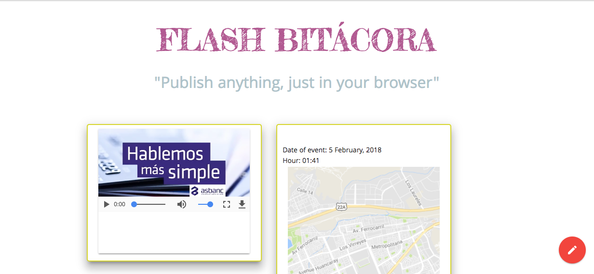

# Flash Bitacora
Vamos a crear una bitácora con la que podrás agregar mensajes, imágenes, audio, video, ubicaciones y fechas. Te sugerimos lo siguiente para llevar a cabo este producto:

1. Usar Materialize como framework de css
2. Usar un FAB, Fixed Action Button que tendrá nuestras opciones.
3. Manejar el DOM, para crear de manera dinámica los elementos que serán agregados a nuestra bitácora

## Desarrollado para 
[Laboratoria](http://laboratoria.la)

